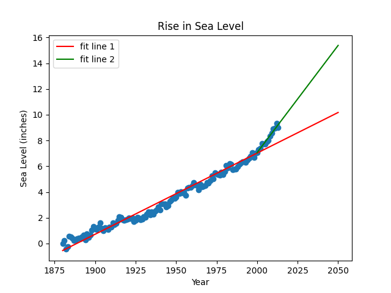

# Pronosticador del nivel del mar

Analizará un conjunto de datos sobre el cambio del nivel medio del mar a nivel mundial desde 1880. Utilizarás los datos para predecir el cambio del nivel del mar hasta el año 2050.

Utiliza los datos para completar las siguientes tareas:

- Utiliza Pandas para importar los datos de `epa-sea-level.csv`.
- Utilice matplotlib para crear un gráfico de dispersión utilizando la `Year` columna como eje x y la `CSIRO Adjusted Sea Level` columna como eje y.
- Usa la función `linregress` de `scipy.stats` para obtener la pendiente e intersección con el eje y de la línea de mejor encaje. Dibuja la línea de mejor encaje sobre el diagrama de dispersión. Haz que la línea pase por el año 2050 para predecir el aumento del nivel del mar en ese año.
- Traza una nueva línea de mejor encaje utilizando datos del año 2000 hasta el año más reciente del conjunto de datos. Haz que la línea pase también por el año 2050 para predecir la subida del nivel del mar en 2050 si el ritmo de subida continúa como desde el año 2000.
- La etiqueta x debe ser `Year`, la etiqueta y debe ser `Sea Level (inches)` y el título debe ser `Rise in Sea Level`.

El texto estándar también incluye los comandos para guardar y devolver la imagen.

## Desarrollo

Escribe tu código en `sea_level_predictor.py`. Para el desarrollo, puedes utilizar `main.py` para probar tu código.

### Gráfica Rise in Sea Level

