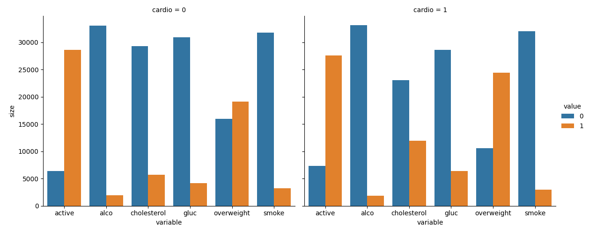
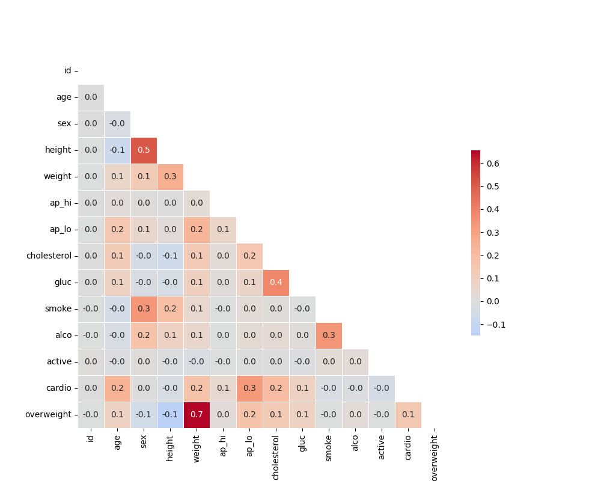

# Visualizador de datos médicos

En este proyecto, visualizarás y realizarás cálculos a partir de datos de exámenes médicos usando `matplotlib`, `seaborn` y `pandas`. Los valores del conjunto de datos (dataset) se reconocieron durante los exámenes médicos.

## Descripción de datos

Las filas del conjunto de datos representan a los pacientes y las columnas representan información como corporales, resultados de varios análisis de sangre y opciones de medidas de estilo de vida. Utilizarás el conjunto de datos para explorar la relación entre enfermedades cardíacas, medidas del cuerpo, indicadores sanguíneos y opciones de estilo de vida.

Nombre del archivo: `examen_medico.csv`

| Característica                                      | Tipo de variable               | Variable    | Tipo de unidad                                      |
|----------------------------------------------------|--------------------------------|-------------|----------------------------------------------------|
| Edad                                               | Característica objetivo        | age         | int (días)                                         |
| Altura                                             | Característica objetivo        | height      | entero (cm)                                        |
| Peso                                               | Característica objetivo        | weight      | flotador (kg)                                      |
| Sexo                                               | Característica objetivo        | gender      | código de categoría                                |
| Presión arterial sistólica                         | Características del examen     | ap_hi       | entero                                             |
| Presión arterial diastólica                        | Característica del examen      | ap_lo       | entero                                             |
| Colesterol                                         | Característica del examen      | cholesterol | 1: normal, 2: por encima de lo normal, 3: muy por encima de lo normal |
| Glucosa                                            | Característica del examen      | gluc        | 1: normal, 2: por encima de lo normal, 3: muy por encima de lo normal |
| Fumador                                            | Característica subjetiva       | smoke       | binario                                            |
| Consumo de alcohol                                 | Característica subjetiva       | alco        | binario                                            |
| Actividad física                                   | Característica subjetiva       | active      | binario                                            |
| Presencia o ausencia de enfermedades cardiovasculares | Objetivo variable              | cardio      | binario                                            |

## Instrucciones

Cree un gráfico similar a `examples/Figure_1.png`, donde mostramos los recuentos de resultados buenos y malos para las variables `cholesterol`, `gluc`, `alco`, `active` y `smoke` para pacientes con `cardio=1` y `cardio=0` en diferentes paneles.

Por cada número en el archivo `medical_data_visualizer.py` agrega el código del número de instrucción asociado a continuación.

1. **Importar datos**: Importe los datos desde `medical_examination.csv` y asígnelos a la variable `df`.
2. **Agregar columna de sobrepeso**: Calcule el IMC dividiendo el peso en kg por el cuadrado de la altura en metros. Si el IMC es > 25, la persona tiene sobrepeso. Use 0 para no sobrepeso y 1 para sobrepeso.
3. **Normalizar datos**: Normalice los datos haciendo que el valor 0 sea bueno y 1 sea malo. Si el valor de `cholesterol` o `gluc` es 1, cámbielo a 0. Si es mayor que 1, cámbielo a 1.
4. **Dibujar gráfica categórica**: Cree la función `draw_cat_plot` para dibujar una gráfica categórica.
5. **Preparar datos para gráfica categórica**: Cree un dataframe usando `pd.melt` para preparar los datos de las columnas `cholesterol`, `gluc`, `smoke`, `alco`, `active` y `overweight` en la variable `df_cat`.
6. **Mostrar resultados**: Enumere una de las columnas para que la función `catplot` funcione correctamente.
7. **Dibujar gráfico categórico**: Use `sns.catplot` para crear un gráfico que muestre los recuentos de valores de las características categóricas.
8. **Guardar figura**: Importe la figura de salida y guárdela en la variable `fig`.
9. **Dibujar mapa de calor**: Cree la función `draw_heat_map` para dibujar un mapa de calor.
10. **Limpiar datos**: Filtre `df_heat` para eliminar datos incorrectos:
   - El valor diastólico de la presión arterial es mayor que el valor sistólico. Mantenga los datos correctos con `(df['ap_lo'] <= df['ap_hi'])`
   - la altura es menor que el porcentaje de 2,5 (Mantenga los datos correctos con `(df['height'] >= df['height'].quantile(0.025))`
   - la altura es superior al 97.5 por ciento
   - el peso es inferior al 2.5 por ciento
   - el peso es mayor al 97.5 por ciento
11. **Calcular matriz de correlación**: Calcule la matriz de correlación y almacénela en la variable `corr`.
12. **Generar máscara para triángulo superior**: Guarde la máscara en la variable `mask`.
13. **Configurar gráfico de calor**: Use `sns.heatmap()` para crear el gráfico de calor con la matriz de correlación.
14. **Graficar matriz de correlación**: Use `sns.heatmap()` para graficar la matriz de correlación con la biblioteca `seaborn`.
15. **Guardar figura**: Importe la figura de salida y guárdela en la variable `fig`.

## Desarrollo

Escribe tu código en `medical_data_visualizer.py`. Para el desarrollo, puedes utilizar `main.py` para probar tu código.

### Gráfico Categórico

### Gráfica Matriz de Correlación

