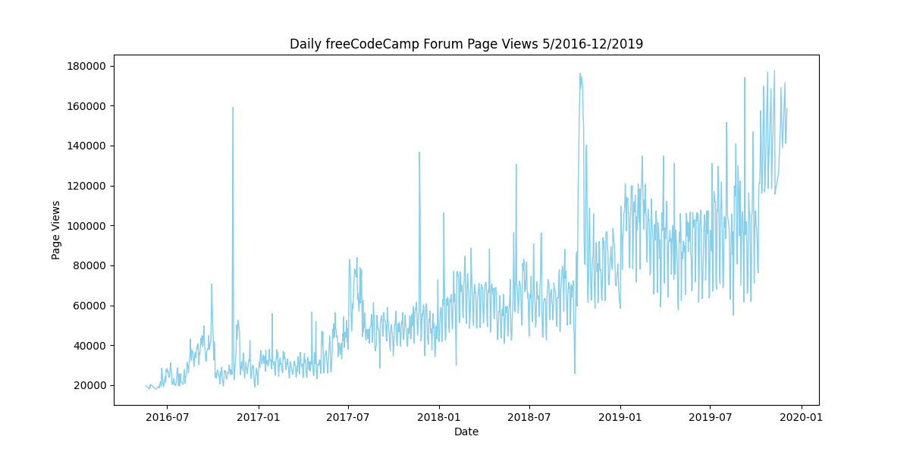
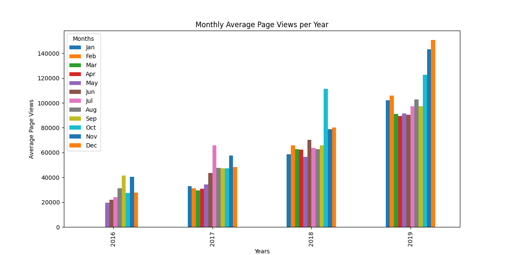
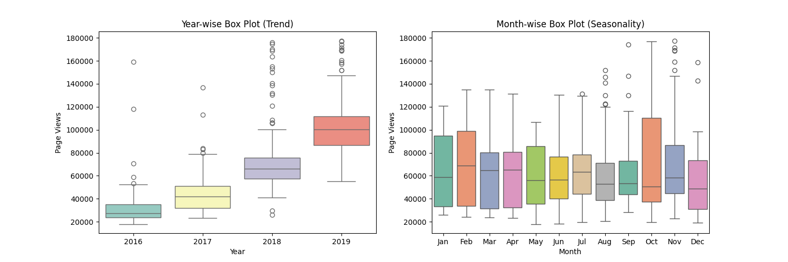

# Visualizador de vistas de página en determinados períodos de tiempo

Para este proyecto, visualizarás los datos de las series temporales utilizando un gráfico de líneas, un gráfico de barras y un gráfico de cajas. Utilizarás Pandas, Matplotlib y Seaborn para visualizar un conjunto de datos que contiene el número de vistas diarias en la página del foro de freeCodeCamp.org del 2016-05-09 al 2019-12-03. Las visualizaciones de datos te ayudarán a entender los patrones en las visitas e identificarán el crecimiento anual y mensual.

Utiliza los datos para completar las siguientes tareas:

- Usa Pandas para importar los datos desde "fcc-forum-pageviews.csv". Establece el índice para la columna `date`.
- Limpiar los datos filtrando los días en que las vistas de la página se encuentran en el 2,5% superior del conjunto de datos o en el 2,5% inferior del conjunto de datos.
- Crea una función llamada `draw_line_plot` que utiliza Matplotlib para dibujar un gráfico de línea similar a "examples/Figure_1.png". El título debe ser `Daily freeCodeCamp Forum Page Views 5/2016-12/2019`. La etiqueta en el eje x debe ser `Date` y la etiqueta en el eje y debe ser `Page Views`.
- Crea una función llamada `draw_bar_plot` que dibuje un gráfico de barras similar a "examples/Figure_2.png". Debe mostrar el número promedio de vistas diarias de cada mes, agrupadas por año. La leyenda debe mostrar las etiquetas de los meses y tener un título de `Months`. En el gráfico, la etiqueta en el eje x debe ser `Years` y la etiqueta en el eje y debe ser `Average Page Views`.
- Crea una función llamada `draw_box_plot` que utiliza Seaborn para dibujar dos diagramas de caja adyacentes similares a "examples/Figure_3.png". Estos diagramas de caja deben mostrar cómo se distribuyen las vistas diarias en el año o en los meses determinado y cómo se comparan con el tiempo. El título del primer gráfico debe ser `Year-wise Box Plot (Trend)` y el título del segundo gráfico debe ser `Month-wise Box Plot (Seasonality)`. Asegúrese de que las etiquetas de los meses en la parte inferior comiencen en `Jan` y que los ejes xey estén etiquetados correctamente. El texto estándar incluye comandos para preparar los datos.

Para cada gráfico, asegúrese de usar una copia de los datos.

El texto estándar también incluye los comandos para guardar y devolver la imagen.

## Desarrollo

Escribe tu código en `time_series_visualizer.py`. Para el desarrollo, puedes utilizar `main.py` para probar tu código.

### Gráfico de Línea

### Gráfico de Barras

### Gráfico de Caja

